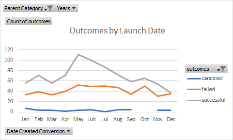
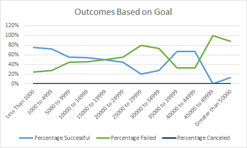

# Kickstarting with Excel

## Overview of Project
In this project I looked at Kickstarter data to help Louise understand the relationship between Kickstarter outcomes based on launch date and funding goals.
### Purpose
The purpose of this project was to help Louise understand how others' campaigns did based on their launch dates and fuding goals. This information will be helpful for Louise to understand which launch dates and funing goals more often have successful outcomes.  
## Analysis and Challenges

### Analysis of Outcomes Based on Launch Date

---
I created a pivot chart and pivot table to look at campaigns by launch date. The launch dates were separated by month, and the outcomes analyzed were successful, failed, and canceled. It's clear looking at the "Outcomes by Launch Date" chart that May is the best month to launch a kickstarter campaign for plays. After May, the successes decline for the rest of the year and hit an all time low in December.
### Analysis of Outcomes Based on Goals

---
To understand outcomes of kickstarter campigns based on their fundraising goal, I created a pivot table and line chart. This chart shows what percentage of plays were successful or failed based on their fundraising goal. The less than $1000 goal has the highest success rate, at 76%. It also appears that as the goal amount increases, the percentage failed tends to increase.
### Challenges and Difficulties Encountered
When creating the pivot table for outcomes based on launch date I initially had trouble figuring out how to group the rows by month, but then learned that I can do this by right clicking and using the group option. I had also never used the COUNTIFS function in excel, so it took some time to understand the required inputs for the function.
## Results

**- What are two conclusions you can draw about the Outcomes based on Launch Date?**
The first thing I noticed was that May seems to be the best month to launch a campaign because there are more successful campaigns in May than any other month. December has the least number of successful outcomes, as well as the highest percentage of failed outcomes, so it's probably the worst month to launch a campaign in.

**- What can you conclude about the Outcomes based on Goals?**
The highest rate of successful campaigns was in the less than $1000 goal group, with 76% being successful. It also appears that the higher the campaign goal is, the more likely your campaign is to fail. This makes sense because a loftier goal is going to be more difficult to meet.

**- What are some limitations of this dataset?**
When looking at outcomes based on goals, I noticed that there were very few data points in some of our goal groupings. For example, there is only 1 in the  $45000 to $49999 range. This skews our data a bit, and makes the success rate 100% for that goal range. There are also some outliers affecting the data, such as the play "The Time Jumper", which had a goal of $100,000,000 and is significantly higher than any other goals in our dataset.

**- What are some other possible tables and/or graphs that we could create?**
We could also look at outcomes by average donation and number of backers to see if it's more important to have large donations, a large number of backers, or both. 
